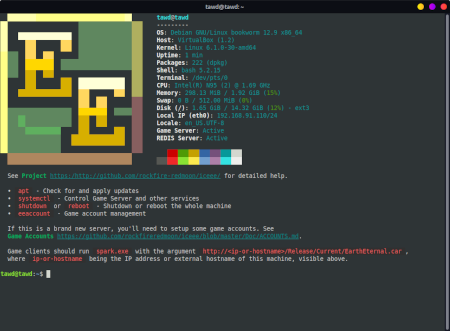

# TAWD Virtual Machines

This project makes use of a tool called [vmmmake](https://github.com/jadaptive/vmmake) to build all-in-one virtual machines that contain everything you need to run an [Earth Eternal](https://github.com/rockfireredmoon/iceee) server game, such as [Earth Eternal, Valkal's Shadow](https://github.com/rockfireredmoon/iceee-data/tree/valkals_shadow).

Logging in to to the VM, this is what you will see ...

 

It contains ..

 * A lightweight Debian 12 based operating system. 
 * The [redis](https://redis.io/) database.
 * The `tawd` game server.
 * Appropriate game Data and client assets.
 * All required dependencies.
 
It is available for a number of different hypervisor platforms. Your provider should support one of these, with a fallback option of installing a generic ISO image.

 * OVA (for VirtualBox, VMWare and others)
 * HyperV (Windows)
 * KVM (Proxmox etc)
 * Docker (Many platforms include modern NAS devices)
 * Generic ISO image (Debian Installer) may also be installed on dedicated 64-bit AMD/Intel hardware
 
The created VMs will also be easily updateable, both the operating system, the tawd server and game and client assets. Uses the familiar `apt` command.

## Obtaining

There are 2 classes of virtual machine available. Cloud provider oriented ones, and on-prem. Use the recommended type for your provider or hypervisor.

### On-Prem

On-prem images will generally involve you having your own Hypervisor software, although some cloud providers may provide ways to upload these images too.

| Platform | File Type | Download |
| -------- | --------- | -------- |
| VirtualBox and Others | OVA       | [tawd-vm-ova-0.9.0.ova](https://files.theanubianwar.com/vms/tawd-vm-ova-0.9.0.ova) |
| Any Hypervisor or Real Hardware | ISO       | [tawd-vm-debianlive-0.9.0.iso](https://files.theanubianwar.com/vms/tawd-vm-debianlive-0.9.0.iso)         |
| HyperV | VHD (zipped) | [tawd-vm-hyperv-0.9.0.zip](https://files.theanubianwar.com/vms/tawd-vm-hyperv-0.9.0.zip) |
| KVM (Linux, Proxmox etc) | RAW (bzip2) | [tawd-vm-kvm-0.9.0.bz2](https://files.theanubianwar.com/vms/tawd-vm-kvm-0.9.0.bz2) |

### Cloud

For Cloud images, either upload the image to your provider, or in the case of Docker, you can "pull" the machine directly from Docker Hub.

| Platform | File Type | Download |
| -------- | --------- | -------- |
| Docker   | Container     | See project page [emeraldicemoon/tawd](https://hub.docker.com/repository/docker/emeraldicemoon/tawd) |
| GCE   | Raw Disk (gzipped) | [tawd-vm-kvm-0.9.0.gz](https://files.theanubianwar.com/vms/tawd-vm-kvm-0.9.0.gz) |
 
## How To Use
 
Simply download the appropriate image for your provider and follow their instructions. Once you have a running virtual machine, you manage it as any other Debian based server.

 1. Install and start your machine.
 1. Login as `tawd`, you will be prompted to create a VM login password. Keep this safe!
 1. Use `apt update` to check if there are any updates, and `apt upgrade` if there are.
 1. Use `eeaccount` to create your game administrator account. 
 
For more instructions on maintaining a server (creating accounts, shard configuration and more), see [Running Your Own Server](https://github.com/rockfireredmoon/iceee/blob/master/Doc/SERVER.md) on the main project. 
 
You can also find instructions there if you want to install on top of another operating system. In that case, you will have to setup redis and any other dependencies yourself. This is no longer the recommend method. 
 
## Building Images

*You will need [vmmmake](https://github.com/jadaptive/vmmake) (which is a bit hard to obtain at the moment, it will be  available in the future). These instructions are mostly for my purposes. It is highly unlikely you will ever need them.*
 
```
vmmake -Pversion=0.9.0 --include=ova --workspace=/home/emerald/Desktop/my_workspace recipe.yml
```

 * `-Pversion` argument is used to when generating the final filename (ensuring they are versions). 
 * `--include` argument is used to specify the target type. Other types include `debianlive` (for the ISO image), `kvm`, `docker`, and more. See the `recipe.yml` file for more.
 * `--workspace` argument is to specify where the temporary build workspace is,and may be used to ensure the temporary workspace needed to build is located on a fast drive. 
 
Look in `artifacts` directory for the results.

### Docker

When publishing to Docker Hub, additional arguments must be passed for authentication. 

```
vmmake -Pdocker.username=yourdockerusername -Pdocker.password=asecret -Pversion=0.9.0 \
    --include=docker --workspace=/fast/cache/vmmake  recipe.yml
```
